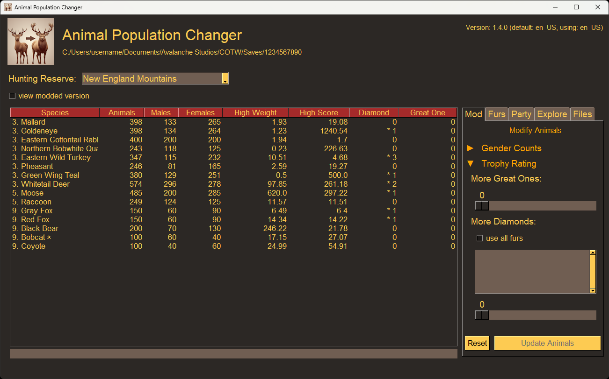

# Animal Population Changer - Revived

A GUI tool to modify attributes of animals across all reserves in *theHunter: Call of the Wild (COTW)*

Release builds are available in multiple locations:
* GitHub: https://github.com/RyMaxim/apc/releases
* NexusMods: https://www.nexusmods.com/thehuntercallofthewild/mods/440



## Features

The following mods are possible with this tool:
1. Make an animal a Great One.
1. Make an animal a Diamond.
1. Make an animal have a rare fur.
1. Make a female animal a male.
1. Make a male a female.

Modded population files can be found in a `mods` folder in the same directory you are running the tool.

## Limitations:

* This tool was tested on Windows 11 with the game installed via Steam. It is smart enough to also look where Epic Games saves its files too. If your game files are saved somewhere else besides where Steam or Epic saves them, use the `Configure Game Path` button.
* The species that use the newer TruRACS trophy system may not become a diamond. This is an area where I am still doing research to figure out how exactly to manipulate.
* If you use the executables (EXE) files, your system may complain there is a virus. This is not true, but the `pyinstaller` package that builds the executable is often used by hackers, and so it is being flagged. To avoid this, simply install the tool from the `wheel` file or build it from source.

## How To Build

> **NOTE:** This was built and tested with Python 3.12.10

1. Install `hatch`: https://hatch.pypa.io/latest/install
1. Set up the virtual environment:
   ```
   hatch env create
   ```
1. Run the application to test:
   ```
   hatch run apcgui
   ```
1. Build and package the application. The `apcgui_X.Y.Z.7z` file will be placed in `\dist`
   ```
   hatch run build
   hatch run pack
   ```

## Updating Translation Data

I am not fluent in multiple languages and have outsourced the translation work to the robots. The translation framework is handled with [Babel](https://github.com/python-babel/babel) and the actual translation text is generated with Google Translate using [deep-translator](https://github.com/nidhaloff/deep-translator).

To update the translation data:
   ```
   hatch run translate
   ```

## Credits

This project would not exist without several generous developers that chose to open-source their tools and mods:
* [**cpypasta**](https://github.com/cpypasta): Developer of the original [Animal Population Changer](https://github.com/cpypasta/apc) that this is forked from
* [**kk49**](https://github.com/kk49): This project relies heavily on the wonderful [DECA](https://github.com/kk49/deca) to extract and modify game files
* [**xpltive**](https://github.com/xpltive)/[**0xsthsth1337**](https://next.nexusmods.com/profile/0xSthSth1337): Cracked the fur type algorithm, shared their code, and assisted greatly with understanding fur seed generation