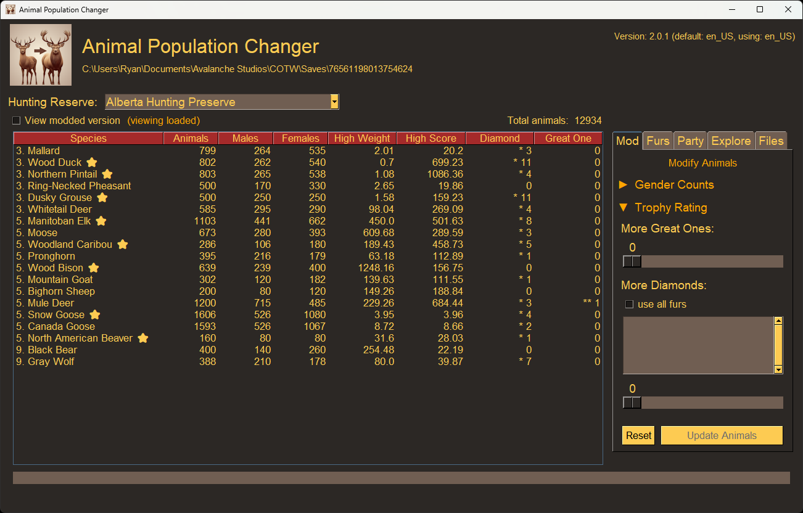

# animal-population-changer

A tool to modify attributes of animals across all reserves in theHunter: Call of the Wild (COTW).

Release builds are available here on GitHub and on NexusMods: https://www.nexusmods.com/thehuntercallofthewild/mods/440



This tool can make all species a diamond, the appropriate species a Great one, or have a rare fur.

The following mods are possible with this tool:
1. Make an animal a Great One.
1. Make an animal a Diamond.
1. Make an animal have a rare fur.
1. Make a female animal a male.
1. Make a male a female.

The modded population files can be found in a `mods` folder in the same directory you are running the tool.

## Limitations:

* This tool was tested on Windows 11 with the game installed via Steam. It is smart enough to also look where Epic Games saves its files too. If your game files are saved somewhere else besides where Steam or Epic saves them, use the `Configure Game Path` button.
* The species that use the newer TruRACS trophy system may not become a diamond. This is an area where I am still doing research to figure out how exactly to manipulate.
* If you use the executables (EXE) files, your system may complain there is a virus. This is not true, but the `pyinstaller` package that builds the executable is often used by hackers, and so it is being flagged. To avoid this, simply install the tool from the `wheel` file or build it from source.

## How To Build

> Note: This code was built and tested with Python 3.10.10.

Setup virtual environment:
```sh
python -m venv venv
venv\Scripts\activate
```

Install dependencies:
```sh
pip install -r requirements.txt
```

You can run the packages directly by using:
```sh
python -m apcgui
```

You can install a developer version by using:
```sh
pip install .
```

If you want to build from a wheel:
```sh
pip install -U build
python -m build
pip install dist/apc-1.4.1-py3-none-any.whl
```

If you want to build directly from GitHub:
```sh
pip install -e git+https://github.com/RyMaxim/apc.git#egg=apc
```

If you want to build an executable (for Windows):
```sh
pip install -U pyinstaller
pyinstaller --noconsole --add-data "apc/config;config" --add-data "apc/locale;locale" --add-data "apcgui/locale;locale" apcgui.py
./dist/apcgui/apcgui.exe
```
